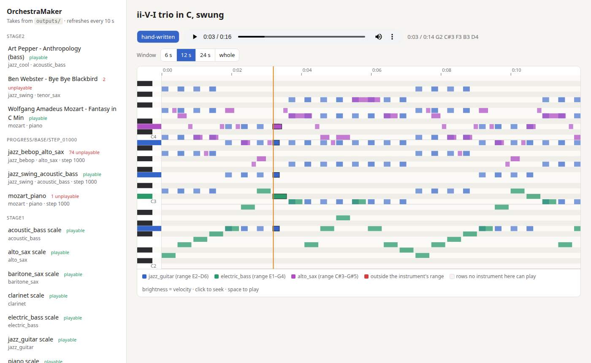

# OrchestraMaker

**An experiment: instead of generating raw audio, teach a small model to *play instruments*.**

Most music-generating AI models (MusicGen, Stable Audio, Suno-like systems) produce the
audio signal itself — they predict compressed waveform/spectrogram tokens directly.
OrchestraMaker takes the other road, the way a human musician does it:

1. **Know the instruments** — every instrument has a range, a polyphony limit and a set of
   techniques (a sax plays one note at a time and has to breathe; a guitar has 6 strings and
   a limited hand stretch; a bass lives in the low register).
2. **Learn the music** — a small transformer studies scores/performances of jazz and classical
   music (Mozart, Bach, jazz solos…) as *note events*, not as sound.
3. **Play** — the model writes a performance (notes, timing, dynamics, articulation) for a
   chosen instrument and style, and an instrument engine turns it into sound.

The question we want to answer: *can a model that fits on a laptop GPU learn to play
convincingly this way?*

## Why this exists

This started as a question I was curious about: music AIs mostly synthesize sound directly —
what happens if a model learns to play instruments instead? OrchestraMaker is my attempt to
find out without it becoming a big time investment.

It is built with **heavy AI-assisted coding**: most of the code is written together with an
AI coding assistant, while I steer the ideas, experiments and decisions. Expect a curiosity
project rather than a polished library.

## Architecture

```
 style + instrument ──► ┌──────────────────────┐   note events    ┌──────────────────┐
     (e.g. "jazz",      │  Performer model     │ ───────────────► │ Instrument engine │ ──► audio
      "alto sax")       │  (small transformer) │  pitch, onset,   │  (SoundFont now,  │
                        └──────────────────────┘  duration, vel., │   DDSP later)     │
                                  ▲               articulation    └──────────────────┘
                                  │                        ▲
                        instrument rules: range, polyphony, playability
```

- **Performer model** — GPT-style decoder over note tokens, conditioned on style and
  instrument tokens. Target size: ~10–50M parameters.
- **Tokens** — `BOS STYLE_mozart INST_piano`, then per note `[TIME_k] PITCH_p VEL_v DUR_d`.
  Time is *performance* time in 10 ms steps rather than a score grid, so swing feel and
  rubato are kept. 345 tokens in total.
- **Instrument definitions** — range, max polyphony, breathing/phrase limits, idiomatic
  techniques. Used both as training-time conditioning and as generation-time constraints.
- **Instrument engine** — starts with [FluidSynth](https://www.fluidsynth.org/) + a free
  General MIDI SoundFont. Later stage: [DDSP](https://github.com/magenta/ddsp)-style
  synthesis, where a network learns to *control* an instrument's pitch and loudness curves
  from real recordings — the closest thing to actually learning to play it.

## Quick start

```bash
python3 -m venv .venv
.venv/bin/pip install torch --index-url https://download.pytorch.org/whl/cu128   # pick your CUDA build
.venv/bin/pip install -r requirements.txt
scripts/get_soundfont.sh                        # ~215 MB, MuseScore General (MIT)
.venv/bin/python scripts/demo_instruments.py    # writes WAVs to outputs/stage1/
.venv/bin/python scripts/prepare_data.py        # downloads datasets (~100 MB), tokenizes into data/tokens/
.venv/bin/python scripts/train.py configs/base.json   # ~35 min on an RTX 5060 Laptop GPU
.venv/bin/python scripts/generate.py --all            # takes into outputs/stage4/
```

`pyfluidsynth` needs the system FluidSynth library (`sudo apt install libfluidsynth3` on Ubuntu).

## Listening UI

```bash
.venv/bin/python scripts/serve.py                                  # http://127.0.0.1:8000
.venv/bin/python scripts/watch_progress.py --run checkpoints/base  # optional: takes from each new checkpoint
```

Every take (hand-written demos, dataset round trips, model generations) shows up with its audio and a
piano roll: the keys light up as notes sound, notes outside the instrument's range are red, and model
takes can be switched between *as generated* and *made playable*.



## Roadmap

The model grows in three versions: first one instrument at a time, then one instrument well,
then instruments together.

**v0 — single instrument, baseline** (done)
- [x] Setup: venv, PyTorch with CUDA on an RTX 5060 (Blackwell needs CUDA 12.8+ builds), FluidSynth.
- [x] Instruments: ranges, polyphony, breathing, guitar/bass fingering; scales and a hand-written trio.
- [x] Data: Weimar Jazz Database + MAESTRO, performance-time tokens with style/instrument conditioning.
- [x] Train: 25M-parameter GPT, ~35 min on the laptop GPU.
- [x] Play: generation, playability report, web UI with a synced piano roll.

The pipeline works end to end, but the music is not good yet: phrases wander and there is little
long-range structure.

**v1 — one instrument, played well (piano first)**
- [ ] Data: [PianoCoRe](https://huggingface.co/datasets/SyMuPe/PianoCoRe) tier B (~18,700 h of
      classical piano, 478 composers, deduplicated and quality-filtered) +
      [PiJAMA](https://almostimplemented.github.io/PiJAMA/) (200+ h of jazz piano).
- [ ] Model: ~100M parameters, 2048-token context, KV-cache generation.
- [ ] Train on a rented A100 (RunPod); tokenization parallel and memory-mapped to handle billions of tokens.
- [ ] Compare v0 and v1 on the same prompts in the web UI.

**v2 — instruments together**
- [ ] Multi-track tokens: every note carries its instrument; the header lists the ensemble.
- [ ] Jazz combo from the Weimar Jazz Database: solo + walking bass + chord-based comping, time-aligned.
- [ ] Real arrangements from the [Lakh MIDI Dataset](https://colinraffel.com/projects/lmd/) (strings, winds, guitar, drums).

**Later**
- Expressive performance (vibrato, bends, ghost notes), DDSP timbre, audio → notes transcription
  so the model can "listen" to recordings.

## Data (openly licensed only)

| Source | Used for | Size | License |
|---|---|---|---|
| [Weimar Jazz Database](https://jazzomat.hfm-weimar.de/dbformat/dboverview.html) | 456 transcribed jazz solos (sax, trumpet, trombone, …) and the walking bass line under them | 200k solo notes, 1.3M tokens | ODbL 1.0 |
| [MAESTRO v3](https://magenta.tensorflow.org/datasets/maestro) | 1,276 classical piano performances, labelled by composer (Mozart: 38 pieces, 5.6 h) | 199 h, 27M tokens | CC BY-NC-SA 4.0 (non-commercial) |
| [PianoCoRe](https://huggingface.co/datasets/SyMuPe/PianoCoRe) | *v1*: classical piano performances with composer labels | ~18,700 h (tier B) | CC BY-NC-SA 4.0 (non-commercial) |
| [PiJAMA](https://almostimplemented.github.io/PiJAMA/) | *v1*: solo jazz piano | 200+ h | CC BY-NC 4.0 (non-commercial) |
| [Lakh MIDI Dataset](https://colinraffel.com/projects/lmd/) | *v2*: multi-instrument arrangements | ~170k files | CC BY 4.0 |

Jazz is ~5% of the tokens, so training will sample by source rather than by token count.

Datasets are **not** committed to this repository; scripts will download them into `data/`.
Each dataset keeps its own license — check it before reuse.

## Hardware target

- **Development and small runs:** a laptop with an RTX 5060 Laptop GPU (8 GB VRAM) and 32 GB RAM.
- **Larger training runs:** a rented cloud GPU (e.g. on [RunPod](https://www.runpod.io/)).

Training is config-driven and checkpointed, so the same run can move between the laptop and a
cloud machine. The goal is training in hours, not weeks.

## License

Code: [MIT](LICENSE). Datasets and SoundFonts: their respective licenses.
